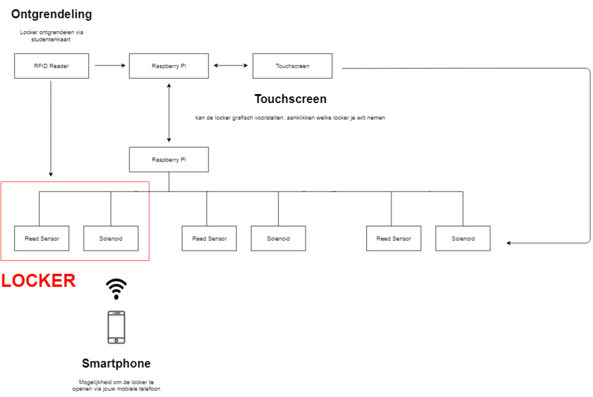
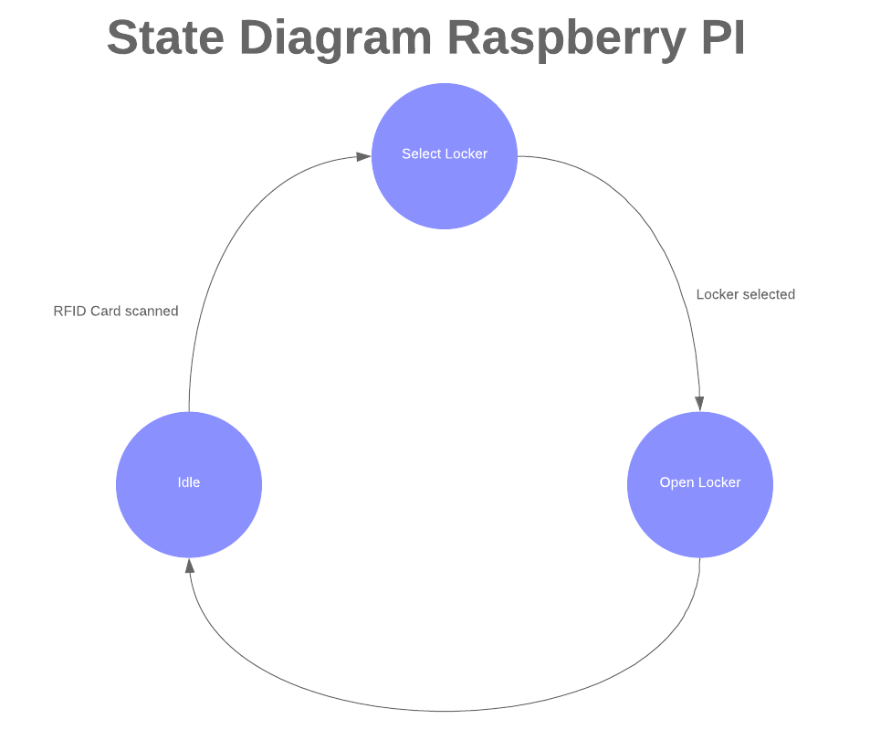

# Analyse

## Probleemstelling

Eenvoudig uitlenen van materiaal, het voorkomen van diefstal of kwijtraken van materiaal.

- Materiaal achterlaten op locatie zonder monitoring
- Materiaal uitwisselen via een locker met een gedeelde key
- Bijhouden van access logs
- Ervoor zorgen dat alleen leerlingen met juiste studentenkaart toegang hebben
- Koppelen van speciefiek materiaal (bv elektronica doos) met een bepaalde locker
- Backup manier om te identificeren voor wanneer de user geen studentenkaart bij de hand heeft
- Mechanische manier om locker te openen als elektronica niet wilt werken
- Gebruiker moet materiaal kunnen reserveren
- Bestalingssysteem voorzien

## Mindmap

## Beschrijving

Zet hier de beschrijving van je project. Licht de functionaliteit van het
project toe.

Een kast lockers met als centrale unit de Raspberry PI. De lockers zullen ontgrendeld kunnen worden via een interface en studentenkaart. Deze interface zou een 
touchscreen, web application of een mobile application kunnen zijn. Via een web application kan de administrator nakijken wie welke locker huurt, welke lockers gereserveerd of in gebruik zijn.

Het monitoren van de locker gebeurt door een sensor. Hierdoor kunnen gebruikers een melding krijgen als ze vergeten zijn hun locker te 
vergrendelen. Gebruikers zouden via een applicatie makkelijk hun studentenkaart aan hun gebruikersaccount kunnen koppelen. Bij een gebruikersaccount zouden we een 
maandelijkse of jaarlijkse kost kunnen invoeren, en deze laten betalen via o.a. Apple Pay, Android Pay, Bancontact en dergelijke. 
Via het web dashboard waar enkel de administrator toegeng tot heeft kan een bepaalde locker geopend worden en kan men ook de access logs bekijken. 

Het identificeren van een locker zou aan de hand van een led zijn. Deze blinkt in een bepaald ritme als deze ontgrendeld is.

## Hardware analyse

Plaats hier een high level blokdiagram van de hardware. Hierin moet duidelijk worden weergegeven wat de verschillende delen zijn en hoe deze met elkaar verbonden zijn. Geef ook een woordje uitleg bij het schema

## Software analyse
### Data In -en Outputs

| Blok          | Data In       | Data Uit|
| ------------- | ------------- | ----- |
| Raspberry Pi  | API calls   | Digital Out |
| Web Server    | nvt.      |   API calls |
| Solenoid lock | 12 V      |    nvt. |
| Reed Sensor   | nvt.      |    Digital HIGH/LOW |

Plaats hier een flow-chart van de software. Hierin moet de werking van de software duidelijk worden weergegeven. Voorzie ook de nodige uitleg.

## User stories en Engineering Tasks

Geef hier de userstories en engineering tasks. De beschrijving moet conform zijn met de methode zoals gezien in de lessen  van projectmanagement vn dhr Peeters.

## systeemspecificaties

Geef hier de systeemspecificaties waaruit je de hardware en software kan ontwerpen

